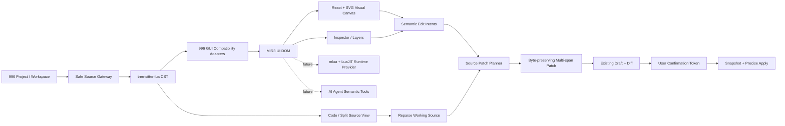

# MIR3 GUI Designer V0.1 Architecture

> 状态：方案设计，等待确认后实施
> 分析日期：2026-08-24
> 分析对象：`mir3-studio-ai` 当前仓库与 `/Users/sml/Desktop/dev5.40.3_d/` 官方 5.40.3 UI 源码
> 本文只分析和设计，不执行官方 Lua，不修改现有业务代码。

## 1. 结论

### 1.1 能不能做

能做，而且当前官方源码非常适合作为第一阶段输入。

V0.1 可以实现类似 Webflow/Figma 的静态 GUI 查看和基础可视化编辑：文件/图层树、SVG 画布、控件选择、属性面板、拖动修改 X/Y、修改文字/图片/尺寸、Visual / Code / Split、Diff、人工确认、精准 Patch。

但要区分两种“查看”目标：

1. **静态布局级预览：可实现。** `GUIExport` 基本是规则化、顺序执行的 GUI 创建和 setter 调用，适合不执行 Lua、直接通过语法树还原。
2. **与 996 客户端运行时完全一致：V0.1 无法保证。** `GUILayout` 含运行时数据、事件、循环、屏幕适配、动态创建、特效和业务状态；字体度量、九宫格、着色器及 996/Cocos 控件语义也不是浏览器 SVG 的天然能力。完全保真需后续独立的 `mlua + LuaJIT` Runtime，或接入真实 996 引擎预览。

因此 V0.1 的产品承诺应是：

> 对静态 `GUIExport` 提供安全、可解释、不会崩溃的可视化编辑；对动态内容提供降级预览和 Unsupported 诊断，不伪装成真实运行结果。

### 1.2 官方源码实测结果

| 项目 | 实测结果 | 对 V0.1 的意义 |
| --- | ---: | --- |
| Lua 文件总数 | 434 | 规模小，适合本地增量解析 |
| `GUIExport` | 249 文件 / 52,379 行 | 静态布局主输入 |
| `GUILayout` | 184 文件 / 68,814 行 | 动态控制器，只读关联和 Unsupported 来源 |
| `GUIData` | 1 文件 / 304 行 | 数据文件，不作为 V0.1 可视布局输入 |
| `luac -p` | 434/434 通过 | 源码语法完整 |
| 标准 `ui.init` Export | 248/249 | 仅 `auto_platform.lua` 是配置表 |
| GUI 创建调用（排除注释） | 5,948 | 可作为兼容覆盖率基线 |
| Panel/Image/Text/Button | 4,856，约 81.6% | V0.1 四类控件可覆盖主要可视元素 |
| 加上结构型 Node | 5,459，约 91.8% | Node 必须作为无外观容器纳入 DOM |
| 含四类核心控件的标准 Export | 245/248 | 绝大多数静态页面有可视结果 |
| `GUIExport` 内动态 GUI 参数 | 未发现 `_V(...)`、`__data__` 或 `FUNCQUEUE` 注册 | V0.1 静态解析成功率预计较高 |
| `GUILayout` 的 Export 加载 | 202 次 `LoadExport`，36 次 `CreateGUIExport` | 业务层明显依赖静态 Export |
| 字面量 Export 引用 | 219 个去重路径，全部能找到对应文件 | 文件关联完整 |
| 动态 Export 引用 | 7 处 | 不能静态确定，需 Unsupported/候选提示 |
| `res/...` 路径字符串 | 1,210 个去重路径 | 资源解析是预览保真的关键 |
| 当前下载目录中的图片资源 | 0 | 仅凭此目录无法显示真实图片，只能占位 |
| 换行 | 248 个纯 CRLF；1 个混合 CRLF/CR | Patch 必须保留原始换行和字节 |
| 最大单个 Export | 约 96 KB | tree-sitter 和 SVG 均可轻松处理 |

注意：创建调用统计按源码文本分析得出，正式实现应以 tree-sitter AST 统计作为最终基线。

### 1.3 当前项目可复用能力

当前仓库并不是从零开始：

- Tauri 2 已有项目目录边界、Workspace 选择、项目扫描和 Lua 索引。
- `mir3-domain` 已有安全文本解码，支持 ASCII、UTF-8、UTF-16、UTF-32、GB18030、BOM 和换行识别。
- 已有 Draft、revision、SHA-256 冲突检测、Diff、一次性确认 token、Snapshot、Apply/Restore 流程。
- 已有 `safe_lua_patch` Tauri 命令和 MIR3 MCP Draft 能力。
- 前端已有开发工具目录和通用 `DevToolWorkspace` 三栏工作区骨架。
- 当前实际依赖为 React `19.2.8`，不是旧说明中的 React 18。后续应以仓库实际版本为准，不为本功能降级 React。

目前缺少：Lua CST/AST 解析器、MIR3 UI DOM、GUI Adapter、SVG 渲染器、资源解析器、代码编辑器和多区间 Source Patch Engine。

现有 `safe_text_patch` 能保留编码，但一次请求最终计算为一个连续替换区间。可视化编辑可能同时修改多个相距很远的字面量，因此 V0.1 应增加“多区间、原字节保真”的 Patch 能力，不能仅把整份新文本当作一次大替换。

## 2. V0.1 范围

### 2.1 必做

- 扫描当前项目/Workspace 内的 `GUIExport/**/*.lua`，并允许用户手动打开其他 Lua。
- 使用 `tree-sitter-lua` 解析 CST，不执行 Lua。
- 将受支持调用转换为统一的 `MIR3 UI DOM`。
- 预览 Panel（对应 `Layout`）、Image、Text、Button；Node 作为结构容器。
- 其他已识别控件生成 `Unsupported` 节点或占位，不中断整棵树。
- 文件树、图层树、画布选择、属性检查。
- 拖动更新 X/Y；属性面板修改 X/Y、宽高、文字和图片路径。
- Visual / Code / Split 三种模式，选择与源码范围双向联动。
- 生成 Patch Plan 和 unified diff；用户确认后进入现有 Draft Apply 流程。
- 保留未修改字节、注释、缩进、引号风格、编码、BOM 和换行。
- 源文件变化、范围冲突、语法错误、资源缺失均显示诊断，不崩溃。

### 2.2 明确不做

- 不在 V0.1 执行 `GUILayout` 业务代码。
- 不模拟网络、角色数据、背包、拍卖、事件注册等 996 运行时状态。
- 不承诺 Effect、RichText、ItemShow、UIModel、Shader、Video、ListView/ScrollView 完整行为。
- 不重写整个 Lua 文件，不做 AST pretty-print。
- 不把官方 5.40.3 源码或资源直接打包进产品；其授权与分发需独立确认。
- 不在 Tauri 主进程中执行不受信任 Lua。

## 3. 技术架构



### 3.1 分层原则

1. **解析与执行分离**：V0.1 只做静态解析，不加载 Lua VM。
2. **DOM 与源码双向绑定**：每个可编辑属性必须保存准确源码范围和原始 token。
3. **视觉状态不直接写盘**：拖动和属性编辑先形成内存中的 Semantic Edit Intent。
4. **Patch 与 Apply 分离**：Patch Engine 只生成候选结果；正式文件仍通过现有 Draft、Diff、确认 token 和 Snapshot 流程应用。
5. **兼容层可扩展**：996 GUI API 的签名和 setter 由 Adapter Registry 管理，避免解析器堆积产品规则。
6. **Unsupported 是数据，不是异常**：未知调用、动态表达式、语法恢复节点都进入 DOM/Diagnostics。
7. **未来 Runtime 可替换预览提供者**：静态 SVG 和 LuaJIT Runtime 通过同一预览接口输出/消费 MIR3 UI DOM。

### 3.2 后端边界

建议新增纯 Rust crate `mir3-ui`，不依赖 Tauri：

- `mir3-ui`：tree-sitter 解析、静态求值、Adapter、DOM、诊断、Patch Plan。
- `mir3-domain`：项目边界、编码、原字节 Patch、Draft、Diff、确认和 Snapshot。
- Tauri bridge：参数校验和 IPC，不包含解析规则。
- React：交互状态和渲染，不直接读取任意本机路径。

这样未来 `mir3-mcp`、桌面 UI 和 Runtime sidecar 可以共享同一 DOM 与 Patch 语义。

### 3.3 核心接口

```rust
trait UiParser {
    fn parse(&self, source: &SourceDocument) -> UiParseResult;
}

trait GuiCompatibilityAdapter {
    fn supports(&self, call: &LuaCall) -> bool;
    fn apply(&self, call: &LuaCall, context: &mut AdapterContext) -> AdapterResult;
}

trait AssetResolver {
    fn resolve(&self, project: &ProjectBoundary, logical_path: &str) -> AssetResult;
}

trait SourcePatchPlanner {
    fn plan(&self, document: &Mir3UiDocument, intents: &[UiEditIntent]) -> PatchPlan;
}

trait PreviewProvider {
    fn build_preview(&self, request: PreviewRequest) -> PreviewResult;
}
```

`StaticSvgPreviewProvider` 在 V0.1 实现；`MluaRuntimePreviewProvider` 仅预留接口。

## 4. 解析与 Compatibility Layer

### 4.1 解析流程

1. 通过项目边界校验读取 Lua 原始字节。
2. 使用现有 Safe Text 能力识别编码、BOM 和换行，得到 UTF-8 Rust `String` 及原始字节元数据。
3. 使用 `tree-sitter-lua` 生成 CST；保留所有注释和 token 范围。
4. 定位 `ui.init` 函数；若没有，则尝试兼容入口或生成文档级 Unsupported。
5. 顺序遍历语句，构建版本化局部符号表。
6. Adapter 识别 `GUI:*_Create` 和后续 setter，将其归并到同一 DOM 节点。
7. 解析父变量，构建树；无法解析的父级挂入 `orphanRoot` 并给出诊断。
8. 输出 DOM、资源引用、源码绑定、Unsupported 和 Diagnostics。

### 4.2 V0.1 Adapter 映射

| 996 API | DOM 类型 | V0.1 处理 |
| --- | --- | --- |
| `GUI:Layout_Create` | `Panel` | 完整基础预览和编辑 |
| `GUI:Image_Create` | `Image` | 完整基础预览和路径/尺寸编辑 |
| `GUI:Text_Create` | `Text` | 完整基础预览和文字/字号/颜色编辑 |
| `GUI:Button_Create` | `Button` | 普通/按下纹理记录，静态显示普通态 |
| `GUI:Node_Create` | `Node` | 无外观结构容器，参与坐标和层级 |
| `GUI:setPosition*` | 通用位置 | 更新或创建位置 Source Binding |
| `GUI:setContentSize` | 通用尺寸 | 更新或创建尺寸 Source Binding |
| `GUI:setAnchorPoint` | 通用锚点 | 参与 SVG 坐标换算 |
| `GUI:setVisible` | 通用可见性 | 隐藏或在编辑器中以“隐藏节点”显示 |
| `GUI:setScale*` / `setRotation*` | 通用变换 | 可解析；V0.1 尽量用 SVG transform 近似 |
| Layout 背景色/透明度 | Panel paint | 基础显示 |
| Button 标题/纹理 setter | Button paint | 基础显示 |
| 其他已知 Create | `Unsupported` | 保留层级、范围和近似边框占位 |
| 任意未知/动态调用 | `UnsupportedOperation` | 保留原文，不改变 DOM 其他部分 |

### 4.3 静态值规则

V0.1 只把以下表达式视为可安全编辑：

- 数字、字符串、长字符串、布尔值和 `nil` 字面量。
- 一元正负号、括号和可证明只含常量的简单算术。
- 由前序静态局部常量唯一决定的值，可作为第二优先级支持。

函数调用、表访问、运行时变量、循环生成值、字符串拼接或存在多条控制流来源时，不执行求值，标记为 `Dynamic`。动态属性可以查看原始表达式，但属性面板默认只读。

### 4.4 符号表注意事项

官方 Export 存在变量名重复赋值，例如多个 `Text_name`。不能用 Lua 变量名、GUI name 或 tag 作为唯一 ID。

- 符号表按“作用域 + 语句顺序 + 变量版本”解析。
- DOM ID 使用 `相对路径 + create-call 起始字节 + 节点类型` 的稳定哈希。
- GUI name、Chinese name、tag 仅作为展示和兼容属性。
- setter 必须绑定到调用位置之前最近的变量版本。

## 5. MIR3 UI DOM 数据结构

以下为 TypeScript 表达，Rust 使用等价 serde 类型；跨 IPC 使用 `camelCase`。

```ts
export interface Mir3UiDocument {
  schemaVersion: '0.1'
  documentId: string
  source: Mir3SourceDocument
  viewport: Mir3Viewport
  roots: string[]
  nodes: Record<string, Mir3UiNode>
  unsupported: Mir3UnsupportedOperation[]
  diagnostics: Mir3UiDiagnostic[]
  assets: Mir3AssetReference[]
}

export type Mir3UiNodeKind
  = | 'Panel'
    | 'Image'
    | 'Text'
    | 'Button'
    | 'Node'
    | 'Unsupported'

export interface Mir3UiNode {
  id: string
  kind: Mir3UiNodeKind
  parentId: string | null
  childIds: string[]
  luaVariable: string | null
  name: BoundValue<string>
  chineseName: BoundValue<string> | null
  tag: BoundValue<number> | null
  position: {
    x: BoundValue<number>
    y: BoundValue<number>
  }
  size: {
    width: BoundValue<number | null>
    height: BoundValue<number | null>
  }
  anchor: {
    x: BoundValue<number>
    y: BoundValue<number>
  }
  transform: Mir3Transform
  visible: BoundValue<boolean>
  touchEnabled: BoundValue<boolean>
  paint: Mir3PanelPaint | Mir3ImagePaint | Mir3TextPaint | Mir3ButtonPaint | null
  source: Mir3NodeSourceBinding
  compatibility: 'Supported' | 'Partial' | 'Unsupported'
  unsupportedReasons: string[]
}

export interface BoundValue<T> {
  value: T
  origin: 'Literal' | 'Constant' | 'Default' | 'Dynamic' | 'Unknown'
  writable: boolean
  raw: string | null
  span: SourceSpan | null
}

export interface SourceSpan {
  startByte: number
  endByte: number
  startPoint: { row: number, column: number }
  endPoint: { row: number, column: number }
}

export interface Mir3NodeSourceBinding {
  createCall: SourceSpan
  statement: SourceSpan
  properties: Partial<Record<Mir3EditableProperty, SourceSpan>>
  sourceSha256: string
}

export interface Mir3SourceDocument {
  projectId: string
  relativePath: string
  sha256: string
  encoding: string
  bom: string
  newline: 'CRLF' | 'LF' | 'CR' | 'Mixed' | 'None'
  byteLength: number
}
```

DOM 中保存引擎坐标原值，不提前改写为浏览器坐标。Renderer 负责坐标转换，Patch Engine 始终使用引擎坐标。

### 5.1 坐标模型

996/Cocos 风格坐标通常以父节点左下角为原点，SVG 以左上角为原点。对于有确定父尺寸的节点：

```text
left = x - anchorX * width
top  = parentHeight - y - (1 - anchorY) * height
```

结构型 Node 没有尺寸时只应用平移，不执行裁剪。父尺寸未知、运行时居中或依赖屏幕尺寸时，节点标记为 `Partial`，画布提供 1136×640、1920×1080 和自定义 viewport 切换。

## 6. React + SVG 编辑器

### 6.1 工作区布局

- 顶部：文件名、保存状态、viewport、缩放、Visual/Code/Split、生成 Diff。
- 左侧：GUI 文件树与当前文件的图层树。
- 中间：SVG 画布；支持平移、缩放、选择框和拖动。
- 右侧：属性面板、兼容状态、源码位置、资源状态。
- 底部或抽屉：Diagnostics、Unsupported、Diff 预览。

可复用现有 `DevToolWorkspace`，但 GUI Designer 的四区布局比当前 Map 骨架复杂，应新增专用 shell，不把全部逻辑塞入一个组件。

### 6.2 渲染策略

- 使用一个 SVG viewport 和分层 `<g>`，而不是每个控件创建绝对定位 HTML。
- Panel 使用 `<rect>` 和背景图；Image/Button 使用 `<image>`；Text 使用 `<text>`。
- 选择框、锚点、辅助线单独放在 overlay layer，不进入业务节点树。
- `pointerdown` 后使用 pointer capture；拖动过程中只更新内存 DOM，`pointerup` 生成一次 `SetPosition` intent，避免每像素生成 Patch。
- 资源图片通过受项目边界约束的 Tauri 资源读取命令返回二进制，前端创建并缓存 object URL；不开放任意 `file://` 路径。
- 缺图时显示带逻辑路径的棋盘格占位，不影响选择和尺寸编辑。
- 大文件按节点树局部更新；画布外层级可后续做视口裁剪，但官方最大文件约 96 KB，V0.1 不必过早复杂化。

### 6.3 图片资源现实限制

`dev5.40.3_d` 只包含 Lua，没有 1,210 个引用路径对应的图片。因此：

- 直接打开此目录时，可以完整查看控件边界、文字、层级和布局，但图片只能占位。
- 要达到接近游戏界面的视觉效果，用户必须把 Designer 指向包含 `res/` 的完整客户端项目，或配置只读 Resource Root。
- Asset Resolver 需按 996 规则支持 Workspace 相对路径、客户端资源根和大小写兼容诊断。
- Windows 大小写不敏感而 macOS/Linux 可能敏感；解析器应报告“仅大小写不匹配”，不能偷偷改 Lua 路径。

### 6.4 Visual / Code / Split

- **Visual**：画布最大化，属性编辑为主。
- **Code**：显示工作副本源码、语法错误和节点范围；建议使用 CodeMirror 6，避免引入完整 IDE 重量。
- **Split**：代码和画布同时展示；选中节点时滚动到 `createCall`，代码光标进入绑定范围时反选节点。
- Code 修改后使用 tree-sitter 增量重解析。语法暂时错误时保留最后一次有效预览，并显示“Preview stale”；不崩溃、不覆盖源码。
- 如果 Code 编辑触及尚未提交的 Visual intent 范围，先尝试按绑定重放；范围冲突则要求用户选择保留 Code 或 Visual 版本，不自动猜测。

## 7. Source Patch Engine

### 7.1 目标

Patch Engine 不生成 Lua，不格式化 Lua，只替换被确认属性对应的原始 token。

例如拖动按钮只允许修改 `GUI:Button_Create(..., 724, 498, ...)` 中 X/Y 的数字 token；不能替换整个创建语句，更不能重写 `ui.init`。

### 7.2 Edit Intent

```ts
export type UiEditIntent
  = | { type: 'SetPosition', nodeId: string, x: number, y: number }
    | { type: 'SetSize', nodeId: string, width: number, height: number }
    | { type: 'SetText', nodeId: string, text: string }
    | { type: 'SetImage', nodeId: string, path: string }
```

每个 intent 必须经过：节点存在、属性可写、Source Binding 存在、值域合法、源 SHA 未变化、原 token 与 `raw` 一致等校验。

### 7.3 Patch Plan

```ts
export interface PatchPlan {
  projectId: string
  relativePath: string
  expectedSha256: string
  expectedRevision: number
  edits: SourceEdit[]
  diagnostics: Mir3UiDiagnostic[]
}

export interface SourceEdit {
  startByte: number
  endByte: number
  expected: string
  replacement: string
  nodeId: string
  property: Mir3EditableProperty
}
```

规则：

1. 编辑范围按原始 UTF-8 解码文本 byte offset 表示，并保证位于字符边界。
2. 多个编辑按范围排序，重叠直接拒绝。
3. 每个范围必须同时校验 `expected` token 和文件 SHA-256。
4. 字符串替换保留原引号形式；无法无损转义时允许在同一 token 内切换合法引号，但仍不扩展到相邻注释。
5. 数字尽量保留原小数精度风格；拖动产生整数时不强制把 `724.00` 改成 `724`。
6. 先在内存应用所有 edits，再用 tree-sitter 重解析；出现新增 ERROR 节点则不创建 Draft。
7. 可选地重新构建 DOM，验证目标属性等于 intent 且非目标属性未发生变化。

### 7.4 原字节保真

tree-sitter 的 byte offset 基于解码后的 UTF-8，源文件可能是 GB18030/UTF-16/混合换行。后端应新增编码感知的 multi-span splice：

- 建立“UTF-8 字符边界 → 原编码 byte offset”映射。
- 对每个 edit 只重新编码 replacement。
- 未编辑区间直接从原始字节复制，不能 decode 后再整体 encode。
- BOM 原样复制；未编辑的 CRLF/CR/LF 原样复制。
- 应用后验证编码/BOM 未变化，且所有未编辑区间逐字节一致。

这比现有单连续区间 `safe_text_patch` 更符合“精准 Patch、不丢注释”的要求。

### 7.5 Draft 和人工确认

推荐流程：

1. Visual/Code 修改只存在于 Working Copy。
2. 用户点击“生成 Diff”。
3. 后端校验并生成 multi-span patched bytes，写入现有外置 Draft，不碰正式项目。
4. UI 展示 unified diff、受影响节点和 Unsupported 警告。
5. 用户确认后调用现有 `draft_preview` 获取一次性 confirmation token。
6. `draft_apply` 再校验 revision、diff hash、source SHA，创建 Snapshot 后原子应用。
7. 源文件在期间变化则以 `SOURCE_CONFLICT` 停止，V0.1 不自动 rebase。

## 8. Unsupported 与错误恢复

### 8.1 Unsupported 分类

- `DynamicExpression`：运行时变量、函数调用或无法静态求值。
- `UnsupportedWidget`：CheckBox、ListView、ScrollView、Slider、LoadingBar、Effect 等尚未实现。
- `UnsupportedSetter`：已识别节点上的未知属性调用。
- `UnknownParent`：父变量无法唯一解析。
- `RuntimeMutation`：`GUILayout` 中运行时 `setPosition`、`setVisible` 等行为。
- `MissingAsset`：逻辑资源路径找不到。
- `ParseRecovery`：tree-sitter 产生 ERROR/MISSING 节点。
- `AmbiguousBinding`：重复变量/别名导致 setter 无法唯一绑定。

### 8.2 降级行为

- 文件级解析失败：Code 可用，Visual 显示文档级 Unsupported。
- 单个节点失败：显示虚线占位，其他节点继续渲染。
- 单个属性动态：仅该属性只读，节点仍可显示其他静态属性。
- 资源缺失：保留尺寸、路径和可选择边框。
- 动态父级：挂到 Orphans 图层，不丢失源码导航能力。
- 任何错误都返回结构化 diagnostics，不允许 Rust panic 或 React 白屏。

## 9. 文件目录建议

```text
src/
  features/gui-designer/
    components/
      gui-designer-shell.tsx
      gui-file-tree.tsx
      gui-layer-tree.tsx
      gui-toolbar.tsx
      gui-inspector.tsx
      gui-diagnostics-panel.tsx
      gui-diff-dialog.tsx
    canvas/
      gui-svg-canvas.tsx
      gui-node-renderer.tsx
      gui-selection-overlay.tsx
      coordinate-transform.ts
    code/
      gui-code-editor.tsx
      source-selection.ts
    model/
      mir3-ui-dom.ts
      edit-intent.ts
      gui-designer-scope.tsx
    services/
      use-get-gui-files.ts
      use-get-gui-document.ts
      use-post-gui-patch-plan.ts
      use-post-gui-draft.ts
    index.ts

src-tauri/
  crates/
    mir3-ui/
      Cargo.toml
      src/
        lib.rs
        dom.rs
        parser.rs
        static_value.rs
        symbol_table.rs
        diagnostics.rs
        patch.rs
        adapters/
          mod.rs
          common.rs
          layout.rs
          image.rs
          text.rs
          button.rs
          node.rs
  src/
    bridge/
      gui_designer.rs
    service/
      gui_designer/
        mod.rs
        asset.rs
  crates/mir3-domain/src/
    safe_files.rs              # 增加 multi-span 原字节 Patch

test/
  gui-designer/
    fixtures/
      static-basic.lua
      comments-crlf.lua
      dynamic-unsupported.lua
      duplicate-symbols.lua
      malformed.lua
```

不建议把完整 `dev5.40.3_d` 复制进仓库。使用小型、可授权的合成 fixture；真实官方语料通过环境变量 `MIR3_996_UI_FIXTURE_ROOT` 运行本地 corpus 测试。

## 10. Tauri 命令建议

```text
gui_files_list(projectId, workspaceRoot?)
gui_document_open(projectId, relativePath, draftId?)
gui_document_reparse(projectId, relativePath, workingSource, expectedSha256)
gui_patch_plan(projectId, relativePath, intents, expectedSha256)
gui_draft_create(projectId, patchPlan)
gui_asset_read(projectId, logicalPath, candidateRoot?)
```

所有命令必须复用 `ensure_safe_project` 和 canonical path boundary；禁止接收并直接读取任意绝对路径。`gui_asset_read` 应限制 MIME、文件大小和资源根，防止路径穿越及超大文件 IPC。

## 11. 开发步骤

### Step 0：语料基线与技术 Spike

- 固化本次 5.40.3 统计脚本和本地 corpus 测试入口。
- 选择并锁定 `tree-sitter` / `tree-sitter-lua` 兼容版本。
- 用 AuctionMain、FriendAddFriend、混合换行文件、动态 `GUILayout` 各做一个解析 Spike。
- 验证 tree-sitter byte range 与现有 Safe Text 编码转换的映射。

验收：434 个文件不 panic；248 个标准 Export 均返回 Document 或结构化 diagnostics。

### Step 1：只读 Parser + MIR3 UI DOM

- 新建 `mir3-ui` crate。
- 实现五个基础 Create Adapter 和通用 setter Adapter。
- 实现版本化符号表、父子树、Source Binding、Unsupported。
- 暴露 `gui_document_open`。

验收：核心控件数量和层级可复核；重复变量不会串绑；未支持调用不影响其他节点。

### Step 2：只读 Web 风格预览

- 接入 GUI 文件树、图层树、SVG 画布、Inspector。
- 实现 viewport、缩放、平移、选择、资源占位和安全 Asset Resolver。
- 对 Panel/Image/Text/Button 提供基础视觉还原。

验收：没有图片资源时仍能查看完整布局边界；有完整 `res/` 时能显示静态纹理。

### Step 3：Visual 基础编辑

- 实现选择、拖动、属性表单和 Semantic Edit Intent。
- X/Y、width/height、text、image 仅对 writable literal 开放。
- 添加本地 undo/redo；一次拖动只生成一个历史操作。

验收：编辑只改变 Working Copy，不写项目文件；动态属性保持只读。

### Step 4：Visual / Code / Split

- 接入 CodeMirror 6 或经评估后的轻量编辑器。
- 实现源码与节点选择同步、增量重解析、last-valid preview。
- 定义 Code 与 Visual 同范围冲突行为。

验收：三种模式不丢选择/滚动状态；临时语法错误不会白屏或覆盖源文件。

### Step 5：精确 Patch、Diff 和确认 Apply

- 在 `mir3-domain` 增加 multi-span 原字节 splice。
- 实现 Patch Plan 校验、二次解析、DOM 回归验证。
- 接入现有 Draft/Diff/confirmation token/Snapshot。

验收：只修改目标 token；注释、缩进、编码、BOM、换行和所有未编辑字节保持不变；源冲突安全停止。

### Step 6：兼容性加固

- 扩展常见 setter 和 Unsupported 占位。
- 加入大小写资源诊断、九宫格近似、基础裁剪和隐藏层显示。
- 跑完整官方语料 corpus、性能、崩溃和安全测试。

验收：官方包全量打开无崩溃；诊断可定位到文件、行列和原始调用。

### Step 7：未来接口，不实现 Runtime

- 定义 `PreviewProvider`、Runtime snapshot 和 AI semantic tool schema。
- 不在 V0.1 引入 LuaJIT 二进制或执行 Lua。

实施完成时再按仓库规则执行产品 patch 版本升级、版本一致性检查、前端/Rust/插件审计、提交和推送；方案文档本身不触发产品版本升级。

## 12. 风险点与应对

| 风险 | 影响 | V0.1 应对 |
| --- | --- | --- |
| 下载包不含 `res/` | 图片不能真实显示 | 占位预览；支持完整项目 Resource Root |
| `GUILayout` 大量运行时变更 | 静态结果与游戏实况不同 | 明确“Static Preview”；只读关联并标记 RuntimeMutation |
| 996/Cocos 坐标和屏幕适配 | 位置可能偏移 | DOM 保留引擎坐标；viewport 切换；未知父尺寸标 Partial |
| 字体、描边、九宫格、Shader 差异 | 无法像素级一致 | SVG 近似并显示兼容等级；Runtime 阶段解决 |
| 变量名、GUI name、tag 重复 | setter 串绑、选错节点 | 语句顺序版本化符号表；range-based ID |
| Lua 动态表达式 | 无法安全静态求值 | 不执行，属性只读并标 Dynamic |
| tree-sitter 错误恢复过度 | 错误节点可能被误编辑 | ERROR 范围及其后不生成 writable binding |
| GB18030/UTF-16/混合换行 | Patch 破坏源文件 | multi-span 原字节复制；编码映射与 byte identity 测试 |
| Code/Visual 同时编辑 | Source Binding 失效 | 每次 Code 改动后重建绑定；重叠冲突显式处理 |
| 外部程序同时修改文件 | 覆盖用户改动 | SHA-256 + revision + expected token 三重校验 |
| 资源路径穿越或超大图片 | 安全/内存风险 | canonical boundary、MIME/大小限制、LRU object URL cache |
| 跨平台路径大小写不同 | macOS/Linux 缺图、Windows 正常 | 精确匹配优先，大小写候选只做诊断 |
| 官方源码授权 | 不能随产品分发 fixture | 只使用本地 corpus；仓库放合成小 fixture |
| LuaJIT 执行不受信任代码 | 主进程安全和稳定性 | 未来放独立 sidecar，最小权限、只读输入、超时和进程级终止 |

## 13. 测试方案

### 13.1 Rust 单元测试

- 每个 Create/Setter Adapter 的参数签名和默认值。
- 单/双引号、`[[...]]`、转义、负数、小数、常量表达式。
- 重复变量、变量重赋值、未知父级、重复 tag/name。
- Unsupported 控件和动态表达式不 panic。
- malformed Lua 的 ERROR/MISSING 诊断。
- Source Binding 起止 byte、行列和 expected token。
- 多 edit 排序、重叠拒绝、越界拒绝、旧 token 冲突。
- ASCII、UTF-8、GB18030、UTF-16、BOM、CRLF、CR、LF、Mixed 的原字节保真。
- Patch 后 tree-sitter 重解析和 DOM 属性回归。

### 13.2 前端单元/组件测试

- 坐标、锚点和父子 transform 计算。
- 图层选择与 SVG 节点选择同步。
- 拖动只在 pointerup 形成单个 intent。
- Inspector 对 Literal 可写、Dynamic 只读。
- MissingAsset、Unsupported、Hidden 节点表现。
- Visual/Code/Split 切换保持选择、缩放和工作副本。
- 源码暂时错误时保持 last-valid preview。

### 13.3 集成测试

1. 在临时 996 项目中打开带注释的 CRLF Lua。
2. 拖动 Button，修改 Text 和 Image。
3. 生成 Diff，断言只出现目标 token 变化。
4. 确认 Draft，应用后断言 Snapshot 已创建。
5. 对比原/新二进制，断言未编辑区间完全一致。
6. 修改源文件制造 SHA 冲突，断言 Apply 被拒绝。
7. Restore Snapshot，断言文件恢复。

### 13.4 官方语料 Corpus 测试

通过 `MIR3_996_UI_FIXTURE_ROOT=/Users/sml/Desktop/dev5.40.3_d` 可选运行：

- 434 个 Lua 全部可读取且流程不 panic。
- 249 个 GUIExport 均返回文档或明确的非布局诊断。
- 248 个标准 Export 中的已支持调用均能归属节点或给出准确原因。
- 所有 219 个字面量 Export 引用可解析到目标文件。
- Unsupported 数量稳定，新增版本变化可通过基线 diff 审核。
- 记录解析耗时、DOM 节点数、峰值内存和诊断分布。

### 13.5 视觉测试

- 为合成 fixture 生成 SVG/PNG golden screenshot。
- 覆盖锚点 0/0、0.5/0.5、1/1，嵌套 Panel、隐藏节点、文字描边和缺图。
- 真实资源可用时，对少量官方页面与 996 客户端截图做人工对照；明确标注静态近似项。

### 13.6 安全与稳定性测试

- `../`、绝对路径、符号链接/reparse point 越界。
- 超大 Lua、超深节点树、循环父引用、超大图片和错误 MIME。
- 随机截断/变异 Lua fuzz，保证无 panic、无无限循环。
- 快速连续拖动、切文件、外部文件变更和 Draft revision 冲突。

## 14. 未来 Runtime 与 AI Agent 预留

### 14.1 `mlua + LuaJIT` Runtime

未来 Runtime 不应替换静态解析器，而是作为第二 Preview Provider：

- 静态解析器负责安全编辑、Source Binding 和精确 Patch。
- Runtime Provider 负责执行动态 `GUILayout`、注入模拟数据并捕获 GUI API 调用轨迹。
- Compatibility Layer 同时可作为 GUI API mock，将运行时调用转成 MIR3 UI DOM mutation。
- Runtime 放独立 sidecar/worker；主 Tauri 进程只通过版本化 IPC 交换快照。
- 需要只读资源映射、禁用任意网络/进程/文件 API、超时、日志上限和进程级终止。

### 14.2 AI Agent

AI 不应直接提交整文件文本。未来 MCP/Agent 工具应使用语义操作：

```text
mir3_ui_list_files
mir3_ui_inspect
mir3_ui_set_position
mir3_ui_set_size
mir3_ui_set_text
mir3_ui_set_image
mir3_ui_preview_diff
```

Agent 输出同样进入 `UiEditIntent -> PatchPlan -> Draft -> Diff -> 人工确认`，与人工可视化编辑共用安全链路。这样可以保证 AI 接入不会绕过源码范围校验、项目边界和确认机制。

## 15. 最终建议

建议批准 V0.1，但以 `GUIExport 静态设计器` 命名和验收，不承诺完整 996 GUI Runtime。

最先实施的纵向切片应是：

> 打开 `GUIExport/auction/auction_main.lua` → 解析为 DOM → SVG 显示 Panel/Image/Text/Button → 选择 `Button_close` → 拖动 X/Y → 生成只改两个数字 token 的 Diff → 人工确认后通过现有 Draft/Snapshot 应用。

这个切片能一次验证 Parser、Adapter、DOM、SVG、Inspector、Source Binding、精确 Patch 和现有安全链路，是进入大规模兼容前风险最低、信息量最高的路径。
